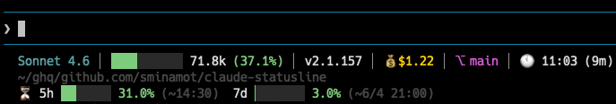

# claude-statusline


## Install

```bash
go install github.com/sminamot/claude-statusline@latest
```

## Setting

`~/.claude/settings.json`

```json
{
  "statusLine": {
    "type": "command",
    "command": "claude-statusline"
  }
}
```

The autocompact threshold is calculated automatically from `context_window_size`:

| Model | Context | Autocompact threshold |
|---|---|---|
| Sonnet 4.6 | 200k | 167,000 tokens (83.5%) |
| Opus 4.8 | 1M | 967,000 tokens (96.7%) |

### CLAUDE_STATUSLINE_CONTEXT_LIMIT_PCT

Optional override for the autocompact threshold percentage. By default, it is auto-calculated as `(context_window_size - 33000) / context_window_size`.

Set this only if you need to override the threshold (e.g. when using `CLAUDE_AUTOCOMPACT_PCT_OVERRIDE` or `CLAUDE_CODE_AUTO_COMPACT_WINDOW`).
